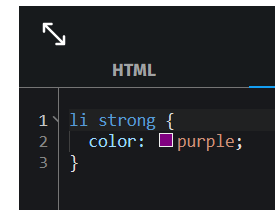
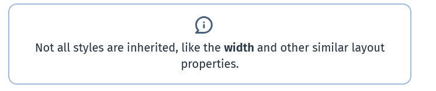

# HTML

- used to describe the structure of the webpage

# Elements

- We can nest elements . basically one inside the other
- elements with no content e.g.  - there are called void elements

# Anatomy of a Web Page

```<!DocType html> ` - used to set rules that the html file has to follow


# CSS
 
 -Styling has priorities
    - inline styling has highest priority
    = External and internal have mid priority. thr styling in the head 
    - browser defaults have low priority
    
- CSS rule
   - a group of style declarations

- uses selectors to target elements for styling 
- Type of selectors
   - class
   - ID
   - element name
   - we can target elements based on their location
   - universal selectors selected by *
   - 
   

   

   pusedo classes
   - https://www.w3schools.com/css/css_pseudo_classes.asp


   -Box Model
      - Css includes the padding and width on as the size of the box

   - Alternative Box Model
      - Css allows you to use this by setting [box-sizing] to [border-box]
      - width taking by the box includes the padding and content width and border


   - LAYOUT
      - Floats
         - must be cleared as it affects elemts that follow it 
      - Flexbox
         - responsive 
         - 
      - CSS grid